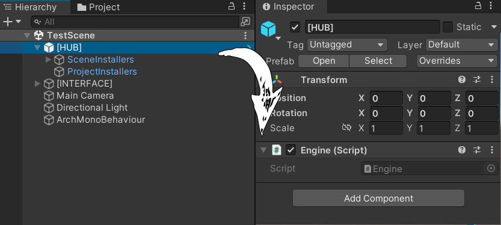
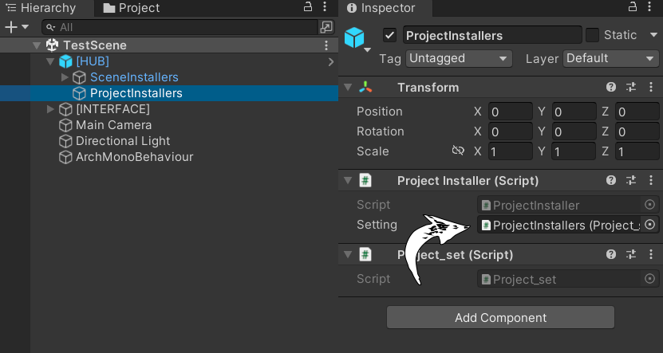

# Readme

## Architecture

```
* Engine (Enterpoint)
    * ProjectInstaller
    * SceneInstallers
    * EventMonoBehaviour
```

Точка входа в приложение является класс Engine. Его необходимо поместить на любой пустой объект. 


Класс Controller и Repository являются единицей архитектуры. Все сервисы, которые мы будем использовать должны быть унаследованы от этих классов.

Класс Installer занимается внедрением ваших сервисов внутрь архитектуры для последующего доступа к ним и представлен в виде двух реализаций: ProjectInstaller и SceneInstaller. 

ProjectInstaller устанавливает все сервисы регистрируемые в нем на уровне всего приложения и загружается только один раз при первом запуске приложения. 

SceneInstaller устанавливает все сервисы регистрируемые в нем на уровне конкретной сцены. Загружает и выгружает ресурсы при переходе между сценами. 

Project и Scene Installer принимают в качестве ресурса для обработки реализацию класса ProjectSetting и SceneSetting соответственно, где и необходимо регистрировать сервисы.


Создадим класс Project_set который будет содержать в себе регистрацию зависимости некого сервиса GameController и его репозитория GameRepository и зарегистрируем его на уровне всего приложения в ProjectInstaller:
```
internal class Project_set : ProjectSetting
    {
        public override Dictionary<Type, Controller> BindControllers()
        {
            var controllers = new Dictionary<Type, Controller>();

            BindController<GameController>(controllers);

            return controllers;
        }

        public override Dictionary<Type, Repository> BindRepositories()
        {
            var repositories = new Dictionary<Type, Repository>();

            BindRepository<GameRepository>(repositories);

            return repositories;
        }
    }
```
После необходимо передать ProjectSetting в поле  Setting у экземпляра ProjectInstaller.



Если все проделано правильно, то сервис GameController будет доступен по:
```
var controller = Engine.Instance.GetController<GameController>();
```

Подобную процедуру можно проделать и с SceneIntaller. Для доступа к экземпляру класса только на уровне одной сцены. 

Controller имеет следующий интерфейс:
```
        public virtual IEnumerator OnAwakeRoutine() { yield break; }
        public virtual IEnumerator InitializeRoutine() { yield break; }
        public virtual IEnumerator OnStartRoutine() { yield break; }
        public virtual IEnumerable OnExitRoutine() { yield break; }
        public virtual void Frame() { }
```

Пайплайн контреллера следующий:
после создания сервиса вызывается OnAwakeRoutine(), после происходит инициализация InitializeRoutine(), далее: OnStartRoutine().

OnExitRoutine() это событие в котором можно писать логику, которая будет выполняться при переходе между сценами для выгрузки или сохранения данных, если это сценозависимый ресурс, либо при выходе из приложения, если это ресурс зарегистрированный на уровне всего приложения.

Frame - аналог Update в Monobehaviour.

Интерфейс Repository:
```
        public virtual IEnumerator OnAwakeRoutine() { yield break; }
        public virtual IEnumerator InitializeRoutine() { yield break; }
        public virtual IEnumerator OnStartRoutine() { yield break; }
        public virtual void Frame() { }
        public abstract IEnumerator SaveRoutine();
```

Репозиторий имеет тот же принцип, что и контроллер, за одним исплючением - абстрактный метод SaveRoutine(); Подразумевается, что репозитории необходимо сохранять используя этот метод. Он не включается в пайплайн настройки и создания репозитория.

Если вам необходим класс который зависим непосредственно от архитектуры и должен начать совершать действия только после тогда как произойдет действие связанное с событиями Controller интерфейса или Repository интерфейса, можно унаследовать ваш класс от EventMonoBehaviour вместо MonoBehaviour. Этот класс содержит список необходимых виртуальных методов, которые вызываются при срабатывании всех возможных событии создания, инициализации и старта контроллеров и репозиториев.

---
## DI

Кастомный Di контейнер.

Для регистрации не MonoBehaviour зависимостей необходимо в классе MonoDI зарегистрировать ваш класс внутри метода  

```
private IContainerBuilder DependenciesRegister(IContainerBuilder builder)
{
    builder.RegistrationSingleton<CustomClass, CustomClass>();
    return builder;
}
```

Для регистрации Mono экземпляров необходимо создать класс наследующий класс Binder:

```
    internal class TestBinder : Binder
    {
        [SerializeField] private TestClass testClass;
        protected override IContainerBuilder BindContainer(IContainerBuilder builder)
        {
            builder.RegistrationSingletonFromInstance<TestClass>(testClass);
            return builder;
        }
    }
```
и реализовать его на сцене с прокидыванием ссылки на экземпляр или префаб.

Для внедрения ваших зависимостей в MonoBehaviour классы необходимо реализовать метод публичный, приватный или статический метод Construct

```
TestClass testClass;
private void Construct(TestClass testClass)
{
    this.testClass = testClass;
    Debug.Log("From construct!");
}
```

---

## UIFramework


---

## Utilits

Утилиты включает в себя:
* Extension Methods
    * CommonExtensions
    * UnityEngineExtensions
* Observeble Variable
    * ObservebleVariable
* Pool of objects
    * MonoPool
* Routine
    * Routine
* Time
    * Stopwatch
    * Timer


